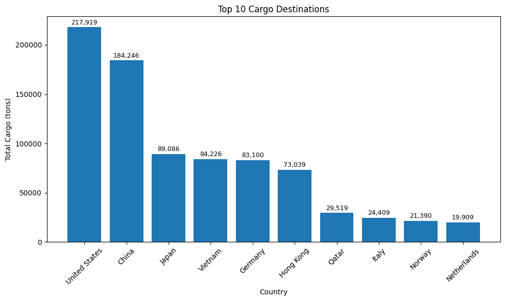
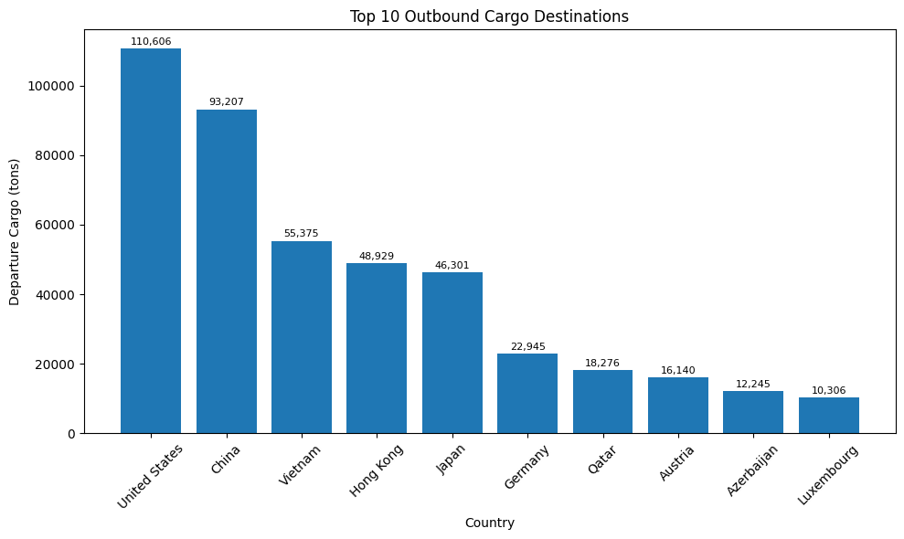
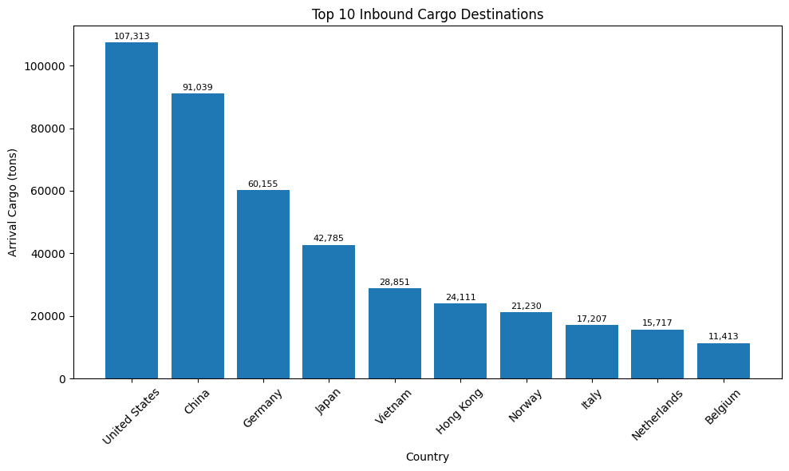
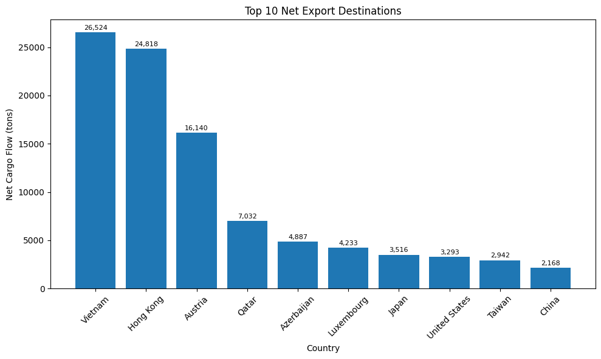
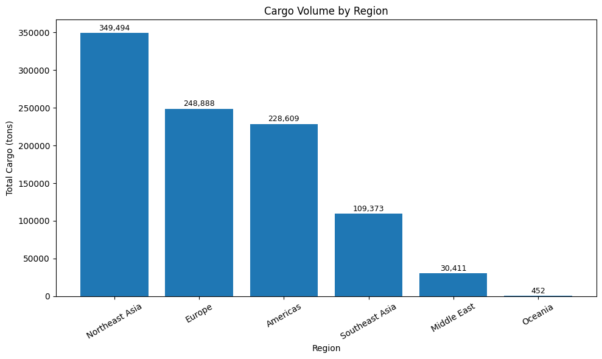
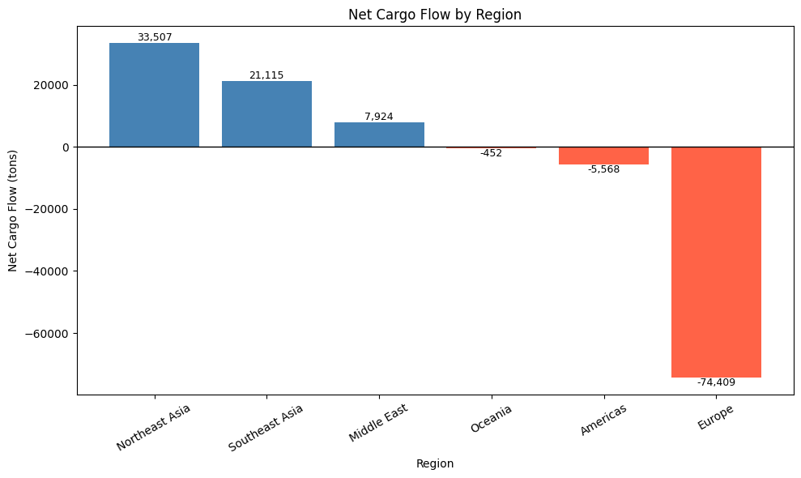
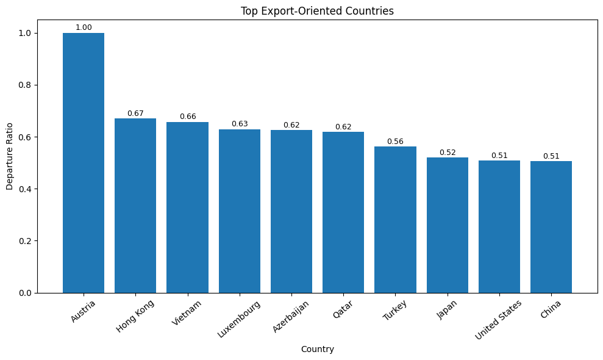

# ✈️ Air Cargo Profitability Analysis

An end-to-end data analytics project that automatically collects international air cargo data from the **Incheon International Airport Open API**, processes the data using Python, and visualizes business insights with Power BI.

The project explores international cargo movement by identifying major cargo destinations, regional distribution, export/import patterns, and trade balance through exploratory data analysis and interactive dashboards.

---

# 📌 Project Objectives

- Collect cargo statistics automatically using an Open API
- Clean and preprocess raw data
- Engineer business-focused analytical features
- Analyze international cargo flows
- Identify export/import patterns and regional cargo distribution
- Build an interactive Power BI dashboard

---

# 🛠️ Tech Stack

- Python
- Pandas
- Matplotlib
- Requests (Open API)
- Jupyter Notebook
- Power BI
- Git
- GitHub

---

# 📡 Data Collection

This project uses the **Incheon International Airport Open API** to collect international air cargo statistics.

The entire data collection process is automated using Python.

### Workflow

```
Incheon International Airport Open API
                │
                ▼
        collect_data.py
                │
                ▼
         Raw Cargo Dataset
                │
                ▼
         preprocess.py
                │
                ▼
    feature_engineering.py
                │
                ▼
   merge_reference_data.py
                │
                ▼
 Exploratory Data Analysis
                │
                ▼
      Power BI Dashboard
```

---

# 📂 Project Structure

```
air-cargo-profitability-analysis/

│
├── dashboard/
│
├── data/
│   ├── raw/
│   ├── processed/
│   ├── featured/
│   └── reference/
│
├── images/
│
├── notebooks/
│   └── 01_eda.ipynb
│
├── src/
│   ├── collect_data.py
│   ├── preprocess.py
│   ├── feature_engineering.py
│   ├── create_route_master.py
│   └── merge_reference_data.py
│
├── requirements.txt
└── README.md
```

---

# 📁 Data Source

### Primary Data

- Incheon International Airport Open API
- International Air Cargo Statistics (2024)

### Reference Data

- Country-to-Region Mapping
- Airport Information

The API data was automatically collected using Python and transformed into an analysis-ready dataset through preprocessing and feature engineering.

---

# 📊 Exploratory Data Analysis

## Analysis 1

### Business Question

Which countries receive the largest amount of cargo?

<p align="center">

</p>

### Insight

- The United States handled the largest cargo volume.
- China ranked second.
- Japan, Vietnam, and Germany were among the major cargo destinations.

---

## Analysis 2

### Business Question

Which countries export the most cargo?

<p align="center">

</p>

### Insight

- The United States exported the highest cargo volume.
- China and Vietnam were also major outbound cargo destinations.

---

## Analysis 3

### Business Question

Which countries import the most cargo?

<p align="center">

</p>

### Insight

- The United States received the highest inbound cargo volume.
- China and Germany were among the largest import destinations.

---

## Analysis 4

### Business Question

Which countries are net exporters?

<p align="center">

</p>

### Insight

- Vietnam recorded the highest positive net cargo flow.
- Hong Kong and Austria also showed strong export-oriented cargo movement.

---

## Analysis 5

### Business Question

Which regions handle the largest cargo volume?

<p align="center">

</p>
### Insight

- Northeast Asia handled the largest cargo volume.
- Europe ranked second, followed by the Americas.
- Southeast Asia also played a significant role in international cargo transportation.

---

## Analysis 6

### Business Question

Which regions are net exporters and which are net importers?

<p align="center">

</p>

### Insight

- Northeast Asia recorded the highest positive net cargo flow.
- Southeast Asia and the Middle East were net-export regions.
- Europe recorded the largest negative net cargo flow, indicating an import-oriented cargo structure.
- Cargo volume alone does not fully explain regional trade balance.

---

## Analysis 7

### Business Question

Which countries are highly export-oriented?

<p align="center">

</p>

### Insight

- Austria recorded the highest departure ratio.
- Hong Kong and Vietnam also demonstrated strong export-oriented characteristics.
- Export ratio complements total cargo volume by highlighting the direction of cargo movement rather than its scale.

---

# 📈 Power BI Dashboard

*(Coming Soon)*

The interactive dashboard will include:

- KPI Cards
- Cargo Volume Overview
- Top Cargo Destinations
- Export vs Import Comparison
- Cargo Volume by Region
- Net Cargo Flow by Region
- Interactive Country Filters
- Drill-down Analysis

<p align="center">

</p>

---

# 🚀 Future Improvements

- Monthly cargo trend analysis
- Route distance analysis
- Time-series forecasting
- Machine learning for cargo demand prediction
- Airline-level cargo analysis
- Interactive web dashboard

---

# 👩‍💻 Author

**Yewon Kim**

Information & Communication Engineering

Aspiring Data Analyst

- GitHub: https://github.com/yewonekim-2002
- LinkedIn: *(Add your LinkedIn profile here)*